# Afluencia-Cablebus-Trolebus-y-Tren-Ligero-Ciudad-de-Mexico-2022-a-2026-Python

**Lenguaje: Python 3.x**

**Librerías: Pandas, Matplotlib, Seaborn, NumPy**

**Entorno: Google Colab / Jupyter Notebook**

## Este proyecto realiza un análisis exploratorio de datos (EDA) sobre la afluencia de pasajeros en los transportes eléctricos (Cablebús, Trolebús, y Tren Ligero) de la Ciudad de México. El objetivo es identificar patrones de movilidad y tendencias estacionales entre los años 2022 y 2026.

**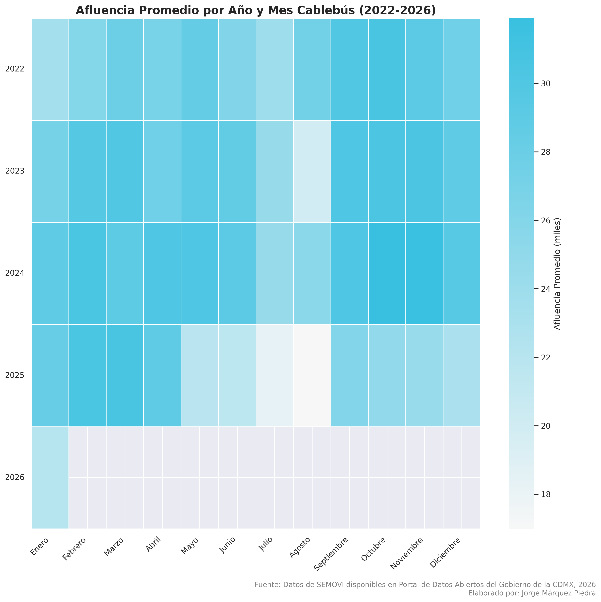**

**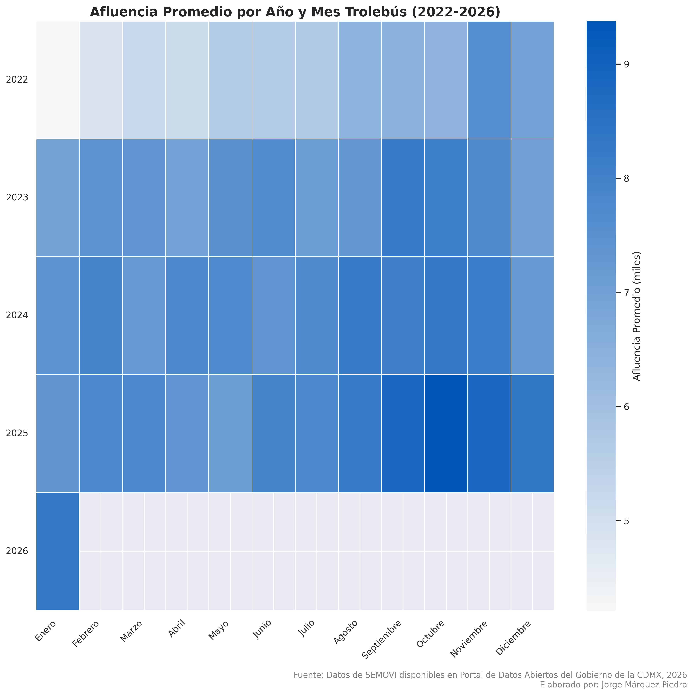**

**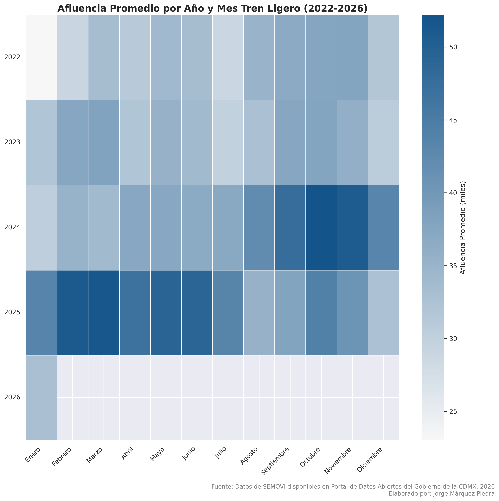**

**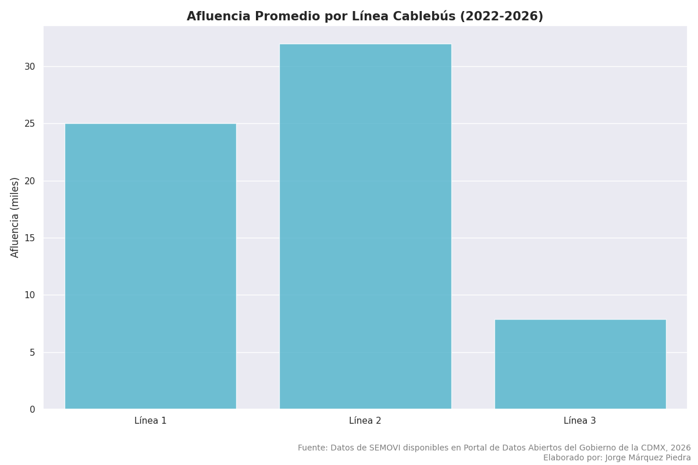**

**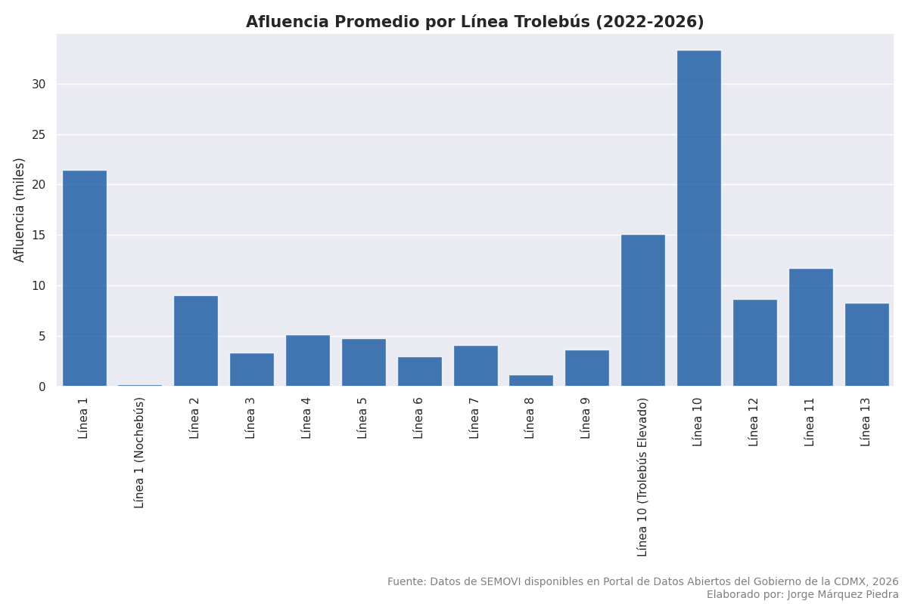**

**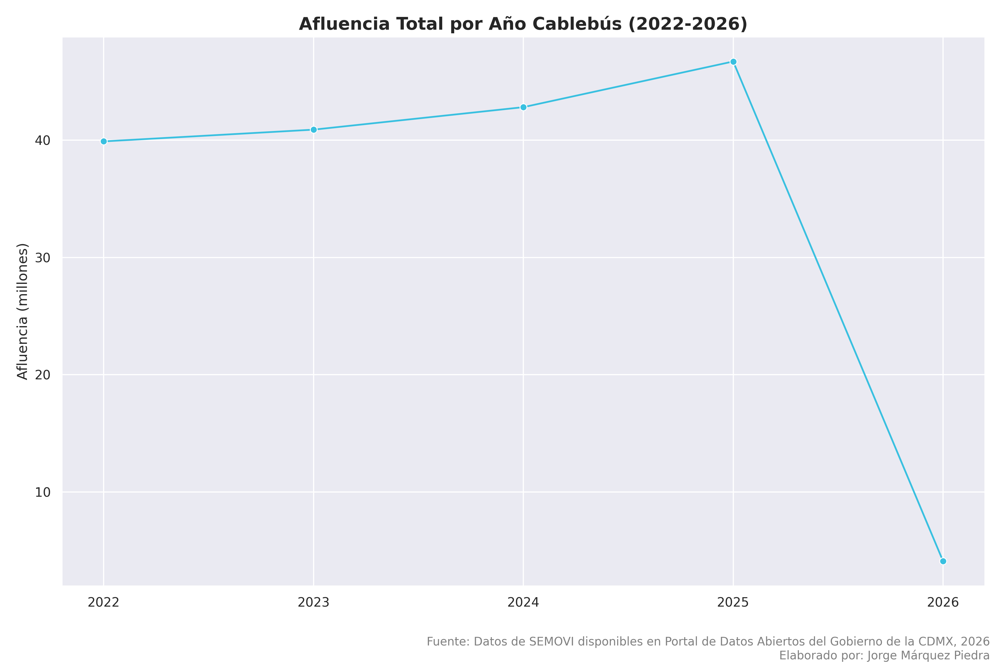**

**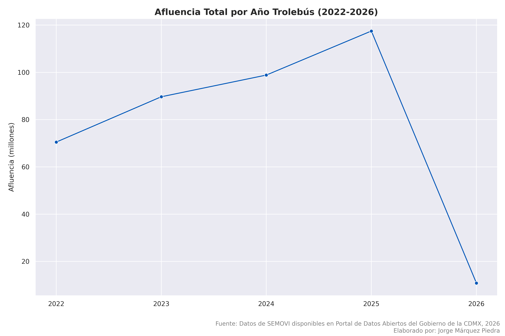**

**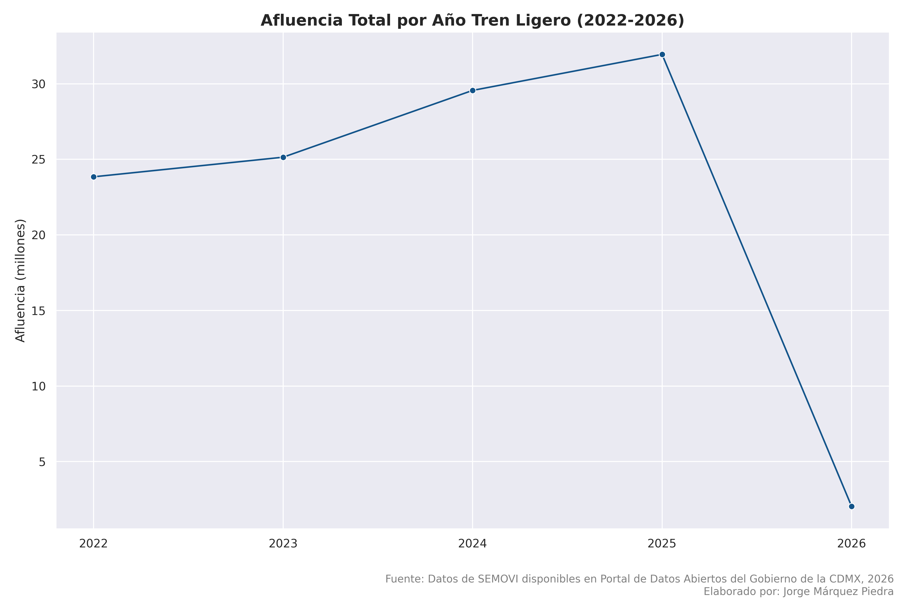**

**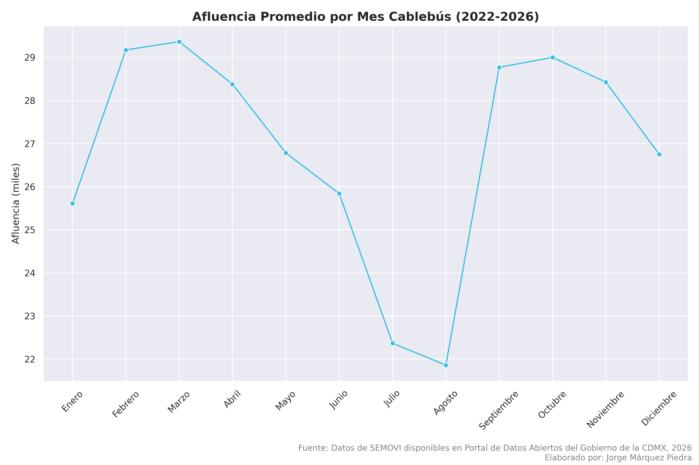**

**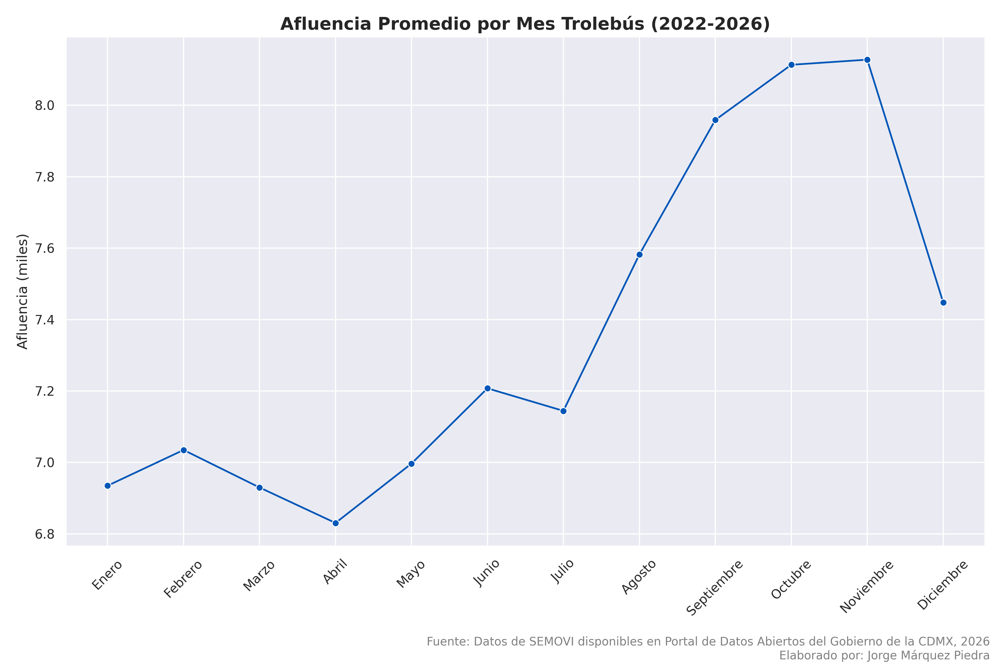**

**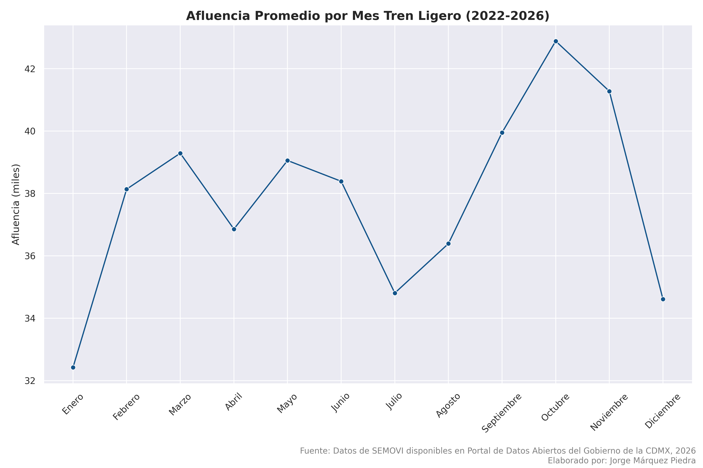**

**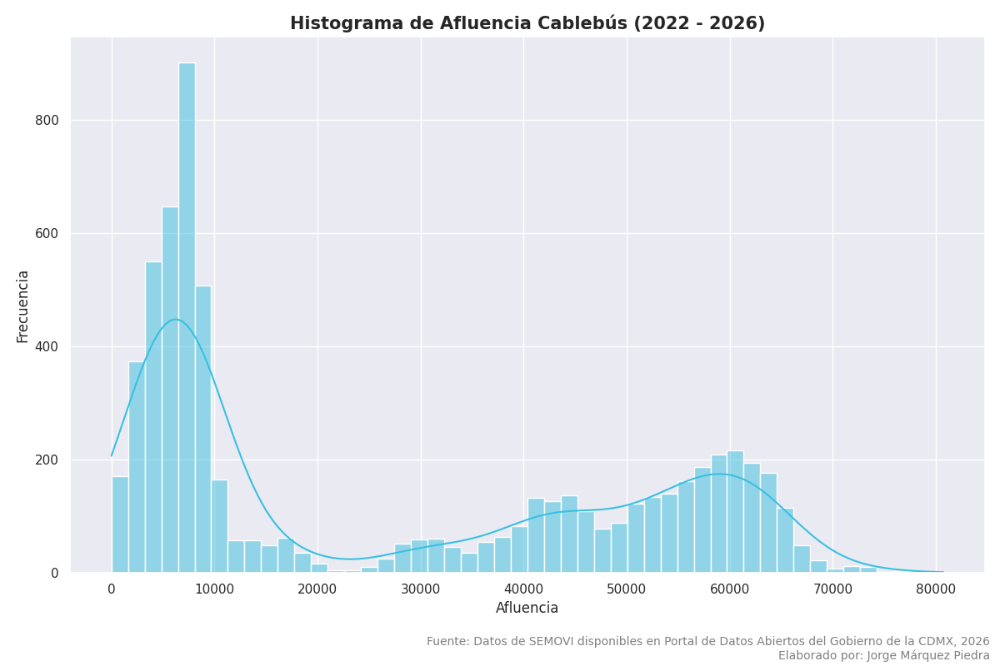**

**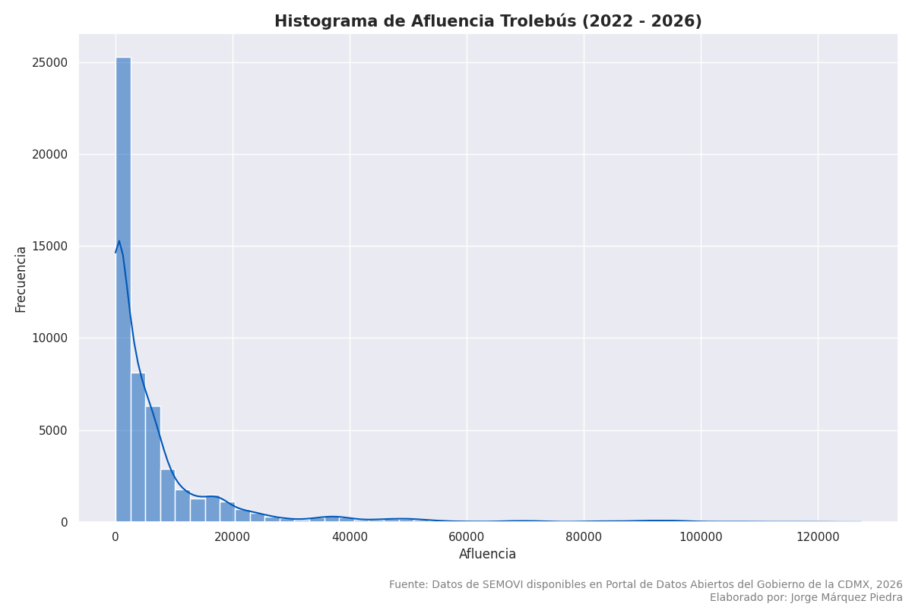**

**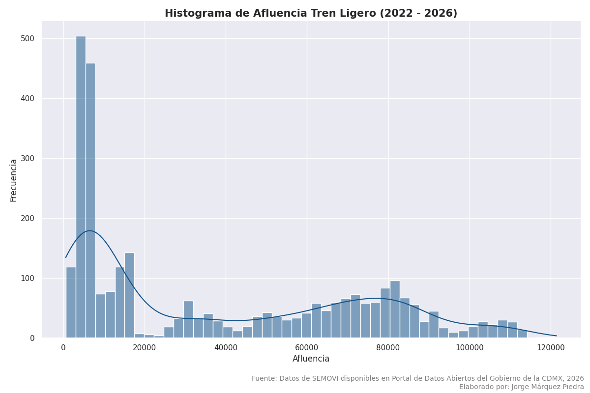**

## Los datos fueron obtenidos del [Portal de Datos Abiertos de la Ciudad de México](https://datos.cdmx.gob.mx/).
